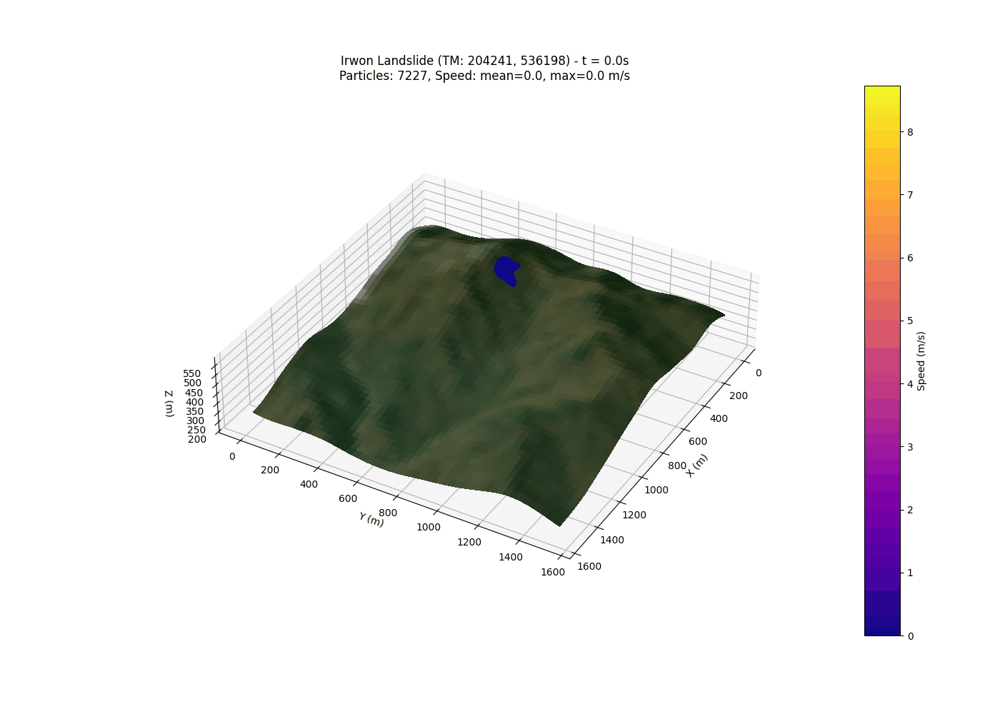
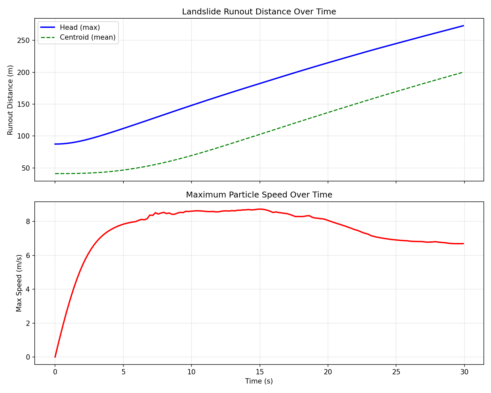

# Landslide SPH Simulation

GPU 가속화된 SPH(Smoothed Particle Hydrodynamics) 기반 산사태 시뮬레이션 프로젝트입니다.

## 개요

이원(Irwon) 지역의 실제 DEM 데이터를 사용하여 산사태 거동을 시뮬레이션합니다. CuPy를 활용한 GPU 병렬 연산으로 수천 개의 입자를 실시간에 가깝게 계산합니다.

## 주요 기능

- **GPU 가속화**: CuPy 기반 벡터화 연산으로 고속 시뮬레이션
- **SPH 유체역학**: Cubic spline 커널, 인공 점성, Tait 상태방정식
- **유변학 모델**: Voellmy 바닥 마찰 + Bingham 항복응력
- **3D 시각화**: 위성 텍스처 오버레이, GIF 애니메이션 생성

## 파일 구조

```
landslide/
├── landslide_sph_gpu.py      # GPU SPH 시뮬레이터 코어 모듈
├── run_simulation.py         # 시뮬레이션 실행 스크립트
├── visualize_results.py      # 결과 시각화 및 애니메이션 생성
├── run_3d_animation.py       # 3D 애니메이션 생성 (대체 버전)
│
├── irwon.dem                 # 이원 지역 DEM 원본 데이터
├── irwon_terrain.npy         # 전처리된 지형 배열
├── irwon_terrain_crop.npy    # 크롭된 지형 배열
├── irwon_terrain_hires.npy   # 고해상도 지형 배열
│
├── simulation_results.npz    # 시뮬레이션 결과 데이터
├── simulation_progress.txt   # 시뮬레이션 진행 로그
│
├── satellite_image.png       # 위성 이미지 원본
├── satellite_texture.png     # 지형 텍스처용 위성 이미지
│
├── irwon_landslide_3d.gif    # 3D 산사태 애니메이션
├── irwon_initial_setup.png   # 초기 입자 배치 이미지
├── runout_distance.png       # 유출 거리 분석 그래프
│
└── backup/                   # 이전 버전 백업
```

## 사용법

### 1. 시뮬레이션 실행

```bash
python run_simulation.py
```

- 이원 지역 DEM 로드
- 붕괴 영역에 입자 초기화
- 30초 시뮬레이션 수행
- 결과를 `simulation_results.npz`에 저장

### 2. 결과 시각화

```bash
python visualize_results.py
```

- 3D 애니메이션 GIF 생성 (`irwon_landslide_3d.gif`)
- 유출 거리 그래프 생성 (`runout_distance.png`)

## 시뮬레이션 파라미터

### SPH 파라미터
| 파라미터 | 값 | 설명 |
|---------|-----|------|
| h | 2.5 m | 스무딩 길이 |
| rho0 | 2000 kg/m³ | 기준 밀도 |
| c0 | 50 m/s | 음속 |
| dt | 0.005 s | 시간 간격 |

### 유변학 파라미터
| 파라미터 | 값 | 설명 |
|---------|-----|------|
| mu | 100 Pa·s | 동점성 계수 |
| tau_y | 50 Pa | 항복 응력 |
| mu_b | 0.1 | 바닥 마찰 계수 |
| xi | 200 m/s² | 난류 계수 |

## 의존성

- Python 3.8+
- NumPy
- CuPy (CUDA 필요)
- Matplotlib
- Pillow
- SciPy

```bash
pip install numpy cupy-cuda12x matplotlib pillow scipy
```

## 좌표계

- **좌표계**: TM (EPSG:5186)
- **원점**: X=203461, Y=535418
- **셀 크기**: 30m

## 출력 예시

### 3D 애니메이션


### 유출 거리 분석


## 참고 문헌

- Bui, H. H., et al. (2008). Lagrangian meshfree particles method (SPH) for large deformation and failure flows of geomaterial using elastic–plastic soil constitutive model.
- Pastor, M., et al. (2009). Application of a SPH depth-integrated model to landslide run-out analysis.
