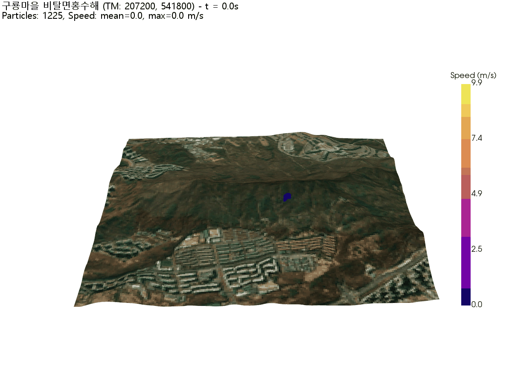

# Landslide SPH Simulation

GPU-accelerated depth-averaged landslide simulation using Smoothed Particle Hydrodynamics (SPH) with non-Newtonian rheology and bed entrainment.

## Overview

This project simulates landslide and debris flow dynamics using real DEM data from Daeomsan (대모산), Irwon-dong, Gangnam-gu, Seoul, South Korea. The simulation implements:

- **Depth-averaged SPH** formulation for computational efficiency
- **Non-Newtonian rheology** (Voellmy + Bingham)
- **Takahashi (2007) entrainment model** for bed erosion/deposition

GPU parallel computing via CuPy enables efficient calculation of thousands of particles.

---

## Sample Results

### 3D Animation



*120-second simulation of debris flow on Guryong terrain. Color represents particle velocity (m/s).*

### Analysis Report

📥 [Download Analysis Report (HTML)](https://raw.githubusercontent.com/JihoeKwon/landslide/main/guryoung_dem_10m/analysis_report.html)

The report includes:
- Key metrics (max velocity, runout distance, concentration)
- AI-powered hazard assessment
- Velocity/slope analysis plots
- Particle distribution visualization

---

## 1. Depth-Averaged Model

### 1.1 Governing Equations

The model uses depth-averaged (shallow water) equations, integrating the 3D Navier-Stokes equations over flow depth. This assumes:
- Hydrostatic pressure distribution
- Depth-averaged velocity profile
- Horizontal length scale >> vertical length scale

**Mass Conservation (Continuity)**:

$$\frac{\partial h}{\partial t} + \nabla \cdot (h \bar{v}) = E - D$$

where:
- $h$ = flow depth [m]
- $\bar{v}$ = depth-averaged velocity [m/s]
- $E$ = entrainment rate [m/s]
- $D$ = deposition rate [m/s]

**Momentum Conservation**:

$$\frac{\partial (h\bar{v})}{\partial t} + \nabla \cdot (h\bar{v} \otimes \bar{v}) = -gh\nabla(h + z_b) - \frac{\tau_b}{\rho} + S$$

where:
- $z_b$ = bed elevation [m]
- $\tau_b$ = basal shear stress [Pa]
- $S$ = source terms (viscosity, etc.)

### 1.2 SPH Discretization

**Depth-averaged continuity** in SPH form:

$$\frac{dh_i}{dt} = \sum_j \Omega_j (v_i - v_j) \cdot \nabla W_{ij}$$

where $\Omega_j = \frac{m_j}{\rho_0 h_j}$ is the particle area.

**Hydrostatic pressure**:

$$P = \frac{1}{2} \rho_0 g h^2$$

**Pressure gradient force** (depth-averaged):

$$\left(\frac{dv}{dt}\right)_{pressure} = -g \sum_j \Omega_j \frac{h_i + h_j}{2} \cdot \nabla W_{ij}$$

### 1.3 References - Depth-Averaged SPH

- **Savage & Hutter (1989)**. The motion of a finite mass of granular material down a rough incline. *J. Fluid Mech.*, 199, 177-215.
- **Pastor, M., et al. (2009)**. Application of a SPH depth-integrated model to landslide run-out analysis. *Géotechnique*, 59(1), 45-57.
- **McDougall, S. & Hungr, O. (2004)**. A model for the analysis of rapid landslide motion across three-dimensional terrain. *Can. Geotech. J.*, 41, 1084-1097.

---

## 2. Non-Newtonian Rheology

Debris flows exhibit non-Newtonian behavior - the relationship between shear stress and strain rate is nonlinear. This simulation combines two rheological models.

### 2.1 Voellmy Friction Model

The Voellmy model (1955) combines Coulomb friction with velocity-dependent turbulent resistance:

$$\tau_b = \mu_b \sigma_n + \frac{\rho g v^2}{\xi}$$

In friction coefficient form:

$$f = \mu_b + \frac{v^2}{\xi}$$

| Parameter | Symbol | Value | Description |
|-----------|--------|-------|-------------|
| Coulomb friction | μ_b | 0.1 | Basal friction coefficient (~6°) |
| Turbulent coefficient | ξ | 200 m/s² | Velocity-squared resistance |

**Physical Interpretation**:

1. **Coulomb term (μ_b·σ_n)**:
   - Dominates at low velocities
   - Represents frictional contact between flow and bed
   - Analogous to dry granular friction

2. **Turbulent term (ρg·v²/ξ)**:
   - Dominates at high velocities
   - Represents energy dissipation from:
     - Internal collisions between particles
     - Turbulent mixing and vortex generation
   - Derived from Chézy formula in open-channel hydraulics

**Limitations**: The Voellmy model is phenomenological (empirical). The coefficient ξ must be calibrated through back-analysis of observed events. Typical values:
- Snow avalanches: ξ = 1000-2000 m/s²
- Debris flows: ξ = 100-500 m/s²
- Rock avalanches: ξ = 500-1000 m/s²

#### μ_b vs Static Friction Angle

The basal friction coefficient $\mu_b$ is related to friction angle $\varphi$ by:

$$\mu_b = \tan(\varphi)$$

| μ_b | Equivalent Angle |
|-----|------------------|
| 0.1 | 5.7° |
| 0.2 | 11.3° |
| 0.3 | 16.7° |
| 0.5 | 26.6° |
| 0.7 | 35.0° |

**Why μ_b = 0.1 (5.7°) instead of typical static friction angles (30-40°)?**

Static friction angles of dry materials:
- Dry sand: 30-35°
- Gravel: 35-45°
- Debris/soil: 25-40°

However, the **effective friction** during debris flow is much lower due to:

| Factor | Effect |
|--------|--------|
| **Pore water pressure** | Water reduces inter-particle contact forces → friction↓ |
| **Fluidization** | High-speed flow causes particles to become suspended |
| **Lubrication** | Water + fine particles form lubricating film |

**Key Distinction**:

| Parameter | Value | Meaning | Used in |
|-----------|-------|---------|---------|
| $\varphi_{bed}$ | 35° | Material property at rest | Entrainment model |
| $\mu_b$ | 0.1 | Effective resistance during flow | Voellmy model |

**Literature values for μ_b** (Hungr, 1995):

| Material | μ_b | Equivalent Angle |
|----------|-----|------------------|
| Saturated debris flow | 0.05-0.15 | 3-9° |
| Rock avalanche | 0.1-0.3 | 6-17° |
| Dry rockslide | 0.4-0.6 | 22-31° |

### 2.2 Bingham Viscoplastic Model

The Bingham model describes fluids with yield stress - flow only occurs when applied stress exceeds a threshold:

$$\tau = \tau_y + \mu \dot{\gamma} \quad \text{if } \tau > \tau_y$$

$$\dot{\gamma} = 0 \quad \text{if } \tau \leq \tau_y$$

| Parameter | Symbol | Value | Description |
|-----------|--------|-------|-------------|
| Yield stress | τ_y | 500 Pa | Minimum stress for flow |
| Plastic viscosity | μ | 100 Pa·s | Viscous resistance |

**Physical Interpretation**:

- **Yield stress (τ_y)**: Represents the internal structure of debris (particle contacts, clay matrix). Flow only initiates when gravitational stress exceeds this threshold.

- **Viscosity (μ)**: Governs the rate of deformation once flowing. Higher viscosity → slower, more uniform flow.

**Stop Condition**: Flow stops when driving stress falls below yield stress:

$$\tau_{driving} = \rho g h \sin\theta$$

$$\tau_{driving} < \tau_y \Rightarrow \text{Flow stops}$$

**Typical Values** (from literature):
| Material | τ_y (Pa) | μ (Pa·s) |
|----------|----------|----------|
| Mudflow | 10-100 | 1-10 |
| Debris flow | 100-1000 | 10-100 |
| Hyperconcentrated flow | 1000-10000 | 100-1000 |

### 2.3 Combined Implementation

The total basal resistance in this model:

**Voellmy friction**:
$$a_{friction} = -g \left( \mu_b + \frac{v^2}{\xi} \right) \frac{\mathbf{v}}{|\mathbf{v}|}$$

**Bingham yield** (applied at low speed, $|v| < 1$ m/s):
$$a_{yield} = -\frac{\tau_y}{\rho_0 h} \frac{\mathbf{v}}{|\mathbf{v}|}$$

The Bingham yield term is applied only at low velocities as a stopping criterion.

### 2.4 References - Rheology

- **Voellmy, A. (1955)**. Über die Zerstörungskraft von Lawinen. *Schweizerische Bauzeitung*, 73, 159-162.
- **Bingham, E.C. (1922)**. *Fluidity and Plasticity*. McGraw-Hill, New York.
- **Hungr, O. (1995)**. A model for the runout analysis of rapid flow slides, debris flows, and avalanches. *Can. Geotech. J.*, 32, 610-623.
- **Iverson, R.M. (1997)**. The physics of debris flows. *Rev. Geophys.*, 35(3), 245-296.
- **Coussot, P. & Meunier, M. (1996)**. Recognition, classification and mechanical description of debris flows. *Earth-Sci. Rev.*, 40, 209-227.

---

## 3. Entrainment Model (Takahashi 2007)

Debris flows can grow significantly by entraining bed material (erosion) or lose volume through deposition. This simulation implements the Takahashi equilibrium concentration model.

### 3.1 Equilibrium Concentration

Takahashi (1991, 2007) proposed that debris flows tend toward an equilibrium sediment concentration that depends on channel slope:

$$C_{eq} = \frac{\rho_w \tan\theta}{(\rho_s - \rho_w)(\tan\varphi - \tan\theta)}$$

| Parameter | Symbol | Value | Description |
|-----------|--------|-------|-------------|
| Water density | ρ_w | 1000 kg/m³ | Interstitial fluid |
| Solid density | ρ_s | 2650 kg/m³ | Sediment particles |
| Bed friction angle | φ | 35° | Internal friction of bed material |
| Slope angle | θ | variable | Local bed slope |
| Max packing | C_max | 0.65 | Maximum solid concentration |

**Physical Meaning**:
- Steeper slopes → higher $C_{eq}$ (more sediment can be transported)
- When $\theta \to \varphi$: $C_{eq} \to \infty$ (slope at failure threshold)
- When $\theta \to 0$: $C_{eq} \to 0$ (flat bed, no transport capacity)

### 3.2 Erosion Rate

When flow concentration is below equilibrium ($C < C_{eq}$), erosion occurs:

$$i_e = \delta_e \cdot C_{eq} \cdot v$$

| Parameter | Symbol | Value | Description |
|-----------|--------|-------|-------------|
| Erosion coefficient | δ_e | 0.0007 | Empirical (0.0001-0.01) |

**Physical Interpretation**:
- Erosion rate proportional to equilibrium concentration (transport capacity)
- Erosion rate proportional to velocity (shear stress on bed)
- The bed lowers at rate i_e, and bed material (at concentration C_bed) enters the flow

### 3.3 Deposition Rate

When flow concentration exceeds equilibrium ($C > C_{eq}$), deposition occurs:

$$i_d = \delta_d \cdot C \cdot v \cdot \left(1 - \frac{\tan\theta}{\tan\varphi}\right)$$

| Parameter | Symbol | Value | Description |
|-----------|--------|-------|-------------|
| Deposition coefficient | δ_d | 0.01 | Empirical (0.01-0.05) |

**Physical Interpretation of** $\left(1 - \frac{\tan\theta}{\tan\varphi}\right)$:
- When $\theta \to \varphi$ (steep slope): factor → 0, **no deposition** (slope too steep to hold sediment)
- When $\theta \to 0$ (flat): factor → 1, **maximum deposition**
- This captures the physical reality that deposited material must be stable on the slope

### 3.4 Mass Conservation

**Flow depth change**:

$$\frac{dh}{dt} = i_e - i_d$$

(erosion increases $h$, deposition decreases $h$)

**Solid mass conservation**:

$$\frac{d(hC)}{dt} = C_{bed} \cdot i_e - C_{bed} \cdot i_d$$

where $C_{bed} = C_{max} = 0.65$ (packed bed concentration).

**Concentration evolution**:
- Erosion: bed material ($C_{bed} = 0.65$) enters → flow concentration increases
- Deposition: material settles at $C_{bed}$ → remaining flow becomes diluted

### 3.5 Erosion vs Deposition: The Role of $C_{init}$

**Critical Insight**: Whether erosion or deposition occurs depends on the relationship between the current concentration ($C$) and the equilibrium concentration ($C_{eq}$) at the local slope.

#### $C_{eq}$ as a Function of Slope

| Slope ($\theta$) | $\tan\theta$ | $C_{eq}$ ($\varphi$=35°) | Behavior if $C_{init}$=0.4 |
|-----------|--------|--------------|------------------------|
| 5° | 0.087 | 0.087 | $C > C_{eq}$ → **Deposition** |
| 10° | 0.176 | 0.204 | $C > C_{eq}$ → **Deposition** |
| 14° | 0.249 | 0.335 | $C > C_{eq}$ → **Deposition** |
| 20° | 0.364 | 0.656 | $C < C_{eq}$ → **Erosion** |
| 25° | 0.466 | 1.21 | $C < C_{eq}$ → **Erosion** |
| 30° | 0.577 | 2.85 | $C < C_{eq}$ → **Erosion** |

**Key Observations**:
- At $\varphi_{bed} = 35°$, the **transition slope** where $C_{eq} = 0.4$ is approximately $\theta \approx 20°$
- On slopes < 20°: $C_{init}(0.4) > C_{eq}$ → Net deposition
- On slopes > 20°: $C_{init}(0.4) < C_{eq}$ → Net erosion

#### Practical Implications

1. **If your terrain is mostly gentle slopes (< 20°)**:
   - With C_init = 0.4, you will see **net deposition**
   - To observe erosion, lower C_init (e.g., 0.2-0.3)

2. **If your terrain is steep (> 20°)**:
   - With C_init = 0.4, you will see **net erosion**
   - The flow will grow by entraining bed material

3. **Parameter Sensitivity**:
   - Higher $\varphi_{bed}$ → Higher $C_{eq}$ → More erosion
   - Lower $C_{init}$ → $C < C_{eq}$ more often → More erosion
   - Higher $\delta_e / \delta_d$ ratio → Faster erosion relative to deposition

#### Recommended C_init Values

| Flow Type | C_init Range | Typical Behavior |
|-----------|--------------|------------------|
| Dilute hyperconcentrated | 0.2-0.3 | Erosion-dominated (bulking) |
| Typical debris flow | 0.4-0.5 | Mixed erosion/deposition |
| Dense granular flow | 0.5-0.6 | Deposition-dominated |

#### Example: Why Net Deposition Occurs

For a simulation with:
- Mean terrain slope: 14°
- $C_{init}$: 0.4
- $\varphi_{bed}$: 35°

At 14° slope:

$$C_{eq} = \frac{1000 \times \tan(14°)}{1650 \times (\tan(35°) - \tan(14°))} \approx 0.34$$

Since $C_{init}$ (0.4) > $C_{eq}$ (0.34), **the flow deposits material** to reduce its concentration toward equilibrium.

### 3.6 Implementation Notes

```python
# Erosion (C < C_eq)
erosion_rate = delta_e * C_eq * speed
dh = +erosion_rate * dt
d(h*C) = +C_bed * erosion_rate * dt

# Deposition (C > C_eq)
slope_factor = max(1 - tan(theta)/tan(phi), 0)
deposition_rate = delta_d * C * speed * slope_factor
dh = -deposition_rate * dt
d(h*C) = -C_bed * deposition_rate * dt
```

### 3.7 References - Entrainment

- **Takahashi, T. (1991)**. *Debris Flow*. IAHR Monograph, Balkema, Rotterdam.
- **Takahashi, T. (2007)**. *Debris Flow: Mechanics, Prediction and Countermeasures*. Taylor & Francis, London. (Primary reference)
- **Egashira, S., et al. (1997)**. Mechanism of debris flow deposition and characteristics of debris flow deposits. *J. Japan Soc. Eng. Geol.*, 38, 149-155.
- **Hungr, O., et al. (2005)**. A review of the classification of landslides of the flow type. *Environ. Eng. Geosci.*, 11(3), 167-194.

---

## 4. Model Parameters Summary

### 4.1 Physical Parameters

| Category | Parameter | Symbol | Value | Reference |
|----------|-----------|--------|-------|-----------|
| **Density** | Reference density | ρ₀ | 2000 kg/m³ | - |
| | Solid particle | ρ_s | 2650 kg/m³ | Typical mineral |
| | Water | ρ_w | 1000 kg/m³ | - |
| **Voellmy** | Basal friction | μ_b | 0.1 | Hungr (1995) |
| | Turbulent coeff. | ξ | 200 m/s² | Calibrated |
| **Bingham** | Yield stress | τ_y | 500 Pa | Coussot (1996) |
| | Viscosity | μ | 100 Pa·s | Coussot (1996) |
| **Entrainment** | Erosion coeff. | δ_e | 0.0007 | Takahashi (2007) |
| | Deposition coeff. | δ_d | 0.01 | Takahashi (2007) |
| | Bed friction angle | φ | 35° | Typical sand/gravel |
| | Initial concentration | C_init | 0.4 | - |
| | Max packing | C_max | 0.65 | Random close packing |

### 4.2 Numerical Parameters

| Parameter | Value | Description |
|-----------|-------|-------------|
| Smoothing length (h) | 2.5 m | SPH kernel size |
| Particle spacing | 2.5 m | Initial particle distance |
| Time step (dt) | 0.005 s | Integration step |
| Cutoff distance | 5.0 m | Neighbor search (2h) |
| Velocity ceiling | 30 m/s | Numerical stability |

---

## 5. File Structure

```
landslide/
├── landslide_sph_gpu.py      # GPU SPH simulator core module
├── run_simulation.py         # Simulation execution script
├── visualize_results.py      # Result visualization and animation
│
├── irwon_terrain_hires.npy   # DEM terrain array
├── simulation_results.npz    # Simulation output data
├── satellite_texture.png     # Satellite texture for visualization
│
├── irwon_landslide_3d.gif    # 3D animation output
├── entrainment_2panel.png    # Entrainment analysis plot
└── runout_distance.png       # Runout distance plot
```

---

## 6. Usage

### Run Simulation
```bash
python run_simulation.py
```

### Visualize Results
```bash
python visualize_results.py
```

---

## 7. Output Data

The simulation saves to `simulation_results.npz`:

| Key | Shape | Description |
|-----|-------|-------------|
| `times` | (N_frames,) | Time stamps [s] |
| `x`, `y` | (N_frames, N_particles) | Positions [m] |
| `vx`, `vy` | (N_frames, N_particles) | Velocities [m/s] |
| `height` | (N_frames, N_particles) | Flow depth [m] |
| `concentration` | (N_frames, N_particles) | Solid concentration [-] |
| `density` | (N_frames, N_particles) | $\rho = \rho_0 h$ [kg/m²] |
| `pressure` | (N_frames, N_particles) | $P = \frac{1}{2}\rho_0 g h^2$ [Pa·m] |
| `terrain` | (ny, nx) | Bed elevation [m] |

---

## 8. References (Complete)

### Depth-Averaged Flow
1. Savage, S.B. & Hutter, K. (1989). The motion of a finite mass of granular material down a rough incline. *J. Fluid Mech.*, 199, 177-215.
2. Pastor, M., et al. (2009). Application of a SPH depth-integrated model to landslide run-out analysis. *Géotechnique*, 59(1), 45-57.
3. McDougall, S. & Hungr, O. (2004). A model for the analysis of rapid landslide motion across three-dimensional terrain. *Can. Geotech. J.*, 41, 1084-1097.

### Rheology
4. Voellmy, A. (1955). Über die Zerstörungskraft von Lawinen. *Schweizerische Bauzeitung*, 73, 159-162.
5. Bingham, E.C. (1922). *Fluidity and Plasticity*. McGraw-Hill, New York.
6. Hungr, O. (1995). A model for the runout analysis of rapid flow slides, debris flows, and avalanches. *Can. Geotech. J.*, 32, 610-623.
7. Iverson, R.M. (1997). The physics of debris flows. *Rev. Geophys.*, 35(3), 245-296.
8. Coussot, P. & Meunier, M. (1996). Recognition, classification and mechanical description of debris flows. *Earth-Sci. Rev.*, 40, 209-227.

### Entrainment
9. Takahashi, T. (1991). *Debris Flow*. IAHR Monograph, Balkema, Rotterdam.
10. Takahashi, T. (2007). *Debris Flow: Mechanics, Prediction and Countermeasures*. Taylor & Francis, London.
11. Egashira, S., et al. (1997). Mechanism of debris flow deposition and characteristics of debris flow deposits. *J. Japan Soc. Eng. Geol.*, 38, 149-155.

### SPH Method
12. Bui, H.H., et al. (2008). Lagrangian meshfree particles method (SPH) for large deformation and failure flows of geomaterial. *Int. J. Numer. Anal. Meth. Geomech.*, 32, 1537-1570.
13. Monaghan, J.J. (1992). Smoothed particle hydrodynamics. *Annu. Rev. Astron. Astrophys.*, 30, 543-574.

---

## 9. Study Area

- **Location**: Daeomsan (대모산), Irwon-dong, Gangnam-gu, Seoul, South Korea
- **Coordinate System**: TM (EPSG:5186) - Korea 2000 / Central Belt
- **Origin**: X=203461, Y=535418
- **Cell size**: 30 m

---

## 10. Dependencies

```bash
pip install numpy cupy-cuda12x matplotlib pillow scipy
```

- Python 3.8+
- NumPy
- CuPy (requires CUDA-capable GPU)
- Matplotlib
- Pillow
- SciPy
